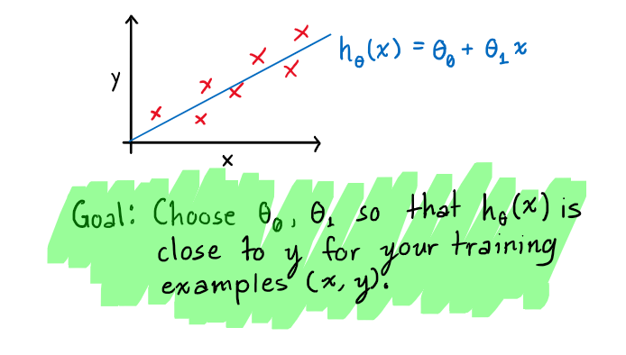
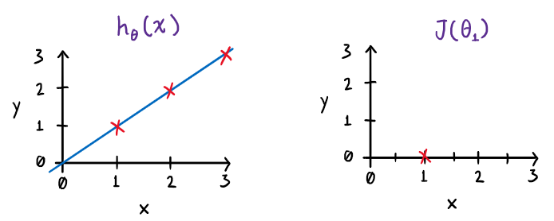
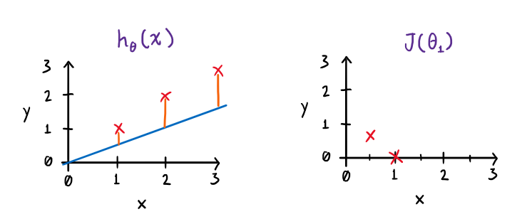
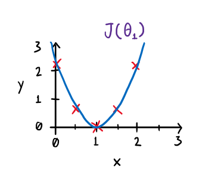

# **MODEL AND COST FUNCTION**

Machine Learning course by Andrew Ng.
Week 1: Model and Cost Function.

## **MODEL REPRESENTATION**

To establish notation for future use, we’ll use  to denote the “input” variables (living area in this example), also called input features, and  to denote the “output” or target variable that we are trying to predict (price). A pair  is called a training example, and the dataset that we’ll be using to learn _a list of m training examples_  is called a training set. Note that the superscript “(i)” in the notation is simply an index into the training set, and has nothing to do with exponentiation. We will also use X to denote the space of input values, and Y to denote the space of output values. In this example, X = Y = ℝ.

<table align="center">
	<thead>
		<tr>
			<th>Size in feet² (x)</th>
			<th>Price ($) in 1000's (y)</th>
		</tr>
	</thead>
	<tbody>
		<tr>
			<td>2104</td>
			<td>460</td>
		</tr>
		<tr>
			<td>1416</td>
			<td>232</td>
		</tr>
		<tr>
			<td>1534</td>
			<td>315</td>
		</tr>
		<tr>
			<td>852</td>
			<td>178</td>
		</tr>
		<tr>
			<td>...</td>
			<td>...</td>
		</tr>
	</tbody>
</table>

To describe the supervised learning problem slightly more formally, our goal is, given a training set, to learn a function h : X → Y so that h(x) is a “good” predictor for the corresponding value of y. For historical reasons, this function h is called a hypothesis. Seen pictorially, the process is therefore like this:

When the target variable that we’re trying to predict is continuous, such as in our housing example, we call the learning problem a regression problem. When y can take on only a small number of discrete values (such as if, given the living area, we wanted to predict if a dwelling is a house or an apartment, say), we call it a classification problem.

## **COST FUNCTION**

We can measure the accuracy of our hypothesis function by using a cost function. This takes an average difference (actually a fancier version of an average) of all the results of the hypothesis with inputs from x's and the actual output y's.

To break it apart, it is  where  is the mean of the squares of , or the difference between the predicted value and the actual value.

This function is otherwise called the "Squared error function", or "Mean squared error". The mean is halved  as a convenience for the computation of the gradient descent, as the derivative term of the square function will cancel out the  term. The following image summarizes what the cost function does:

## **COST FUNCTION**

If we try to think of it in visual terms, our training data set is scattered on the x-y plane. We are trying to make a straight line (defined by ) which passes through these scattered data points.

Our objective is to get the best possible line. The best possible line will be such so that the average squared vertical distances of the scattered points from the line will be the least. Ideally, the line should pass through all the points of our training data set. In such a case, the value of  will be 0. The following example shows the ideal situation where we have a cost function of 0.

When , we get a slope of 1 which goes through every single data point in our model. Conversely, when , we see the vertical distance from our fit to the data points increase.

This increases our cost function to 0.58. Plotting several other points yields to the following graph:

Thus as a goal, we should try to minimize the cost function. In this case,  is our global minimum.
